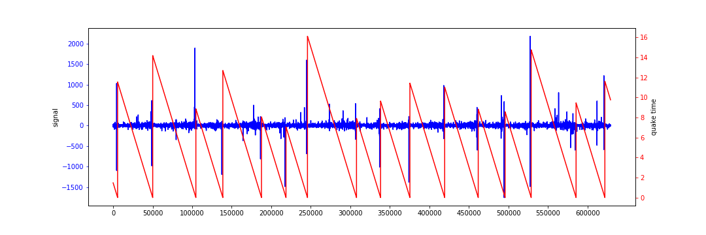
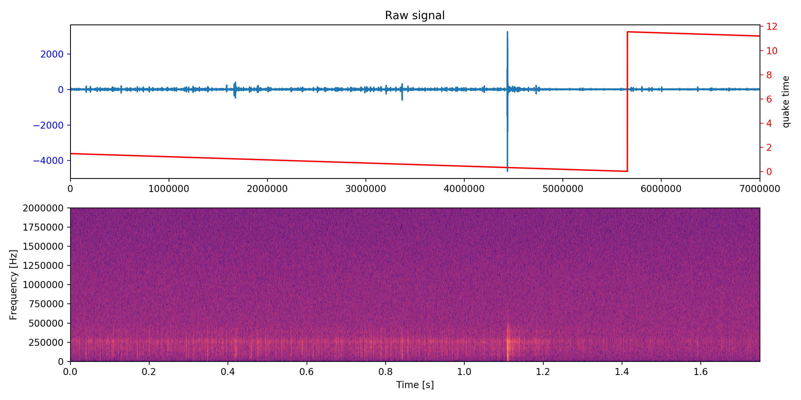

# Attempt to get LANL Earthquake Prediction
https://www.kaggle.com/c/LANL-Earthquake-Prediction/
Финальный текст работы: [ссылка](final_paper_text.pdf)

## EDA
Тренировочный датасет включает в себя два вектора: сигнал и время до землетрясения
(в секундах).  
Размер датасета составляет ~629 млн. точек.

Исходный сигнал и таргет (время до землетрясения) при наложении друг на друга 
выглядят следующим образом:

Как видно на картинке, в тренировочном датасете мы наблюдаем 16 землетрясений.

Посмотрим на семпл из первых 7 млн. точек на спектрограмме:

Наблюдения: 
* До землетрясения есть характерный толчок, который прошивает все частоты.
* Спектр выше 500 MHz можно отбрасывать, т.к. ничего интересного там не происходит.

Тестовые данные в соревновании представлены 2624 кусками по 150 тыс. точек.
Соответственно, предикт нужно было сделать для последней точки.  
Неизвестно каким образом нарезались данные куски и принадлежат ли они тому же эксперименту,
откуда были взяты данные для тренировочной выборки. 
Вполне возможно, что в тестовых кусках присутствует обнуление таргета, что очень плохо.

## Описание решения
В рамках решения задачи я попробовал несколько подходов:
1. Использование 1d сверток на голом сигнале.
2. Преобразование голого сигнала в спектрограммы и обработка их как обычных картинок 
с помощью претрененных резнетов.
3. Обучение представлений кусков сигнала с помощью contrastive predictive coding (CPC), 
с последующим прогнозированием таргета.

Интересности:
* Несмотря на то, что задача является регрессией. 
Стандартный подход не дал хороших результатов, т.к. сетка сходилась к тривиальному 
решению и совсем не хотела учиться. 
Сломить такое поведение сети помог перевод задачи в классификацию на несколько бинов таргета. 
* Если после CPC добавить голову на классификацию таргета, то она моментально начнет переобучаться.
Если же классификационную голову не добавлять, то CPC отдельно будет долго учиться.
* Если клипать нормализованный сигнал даже на (-10, 10), то градиенты CPC моделей уходят в 0.  

Интересности LSML части:
* Не поняв, что происходит в скриптах, которые нужно использовать по официальной инструкции 
пришлось самостоятельно поднять тачку, примонтировать диск и настроить окружение.
* На использование многих торчовых методов PyCharm ругается потому что не видит их в `__init__`.
Оказывается, ни один из разработчиков коровской команды торча не использует 
[PyCharm](https://github.com/pytorch/pytorch/issues/7318#issuecomment-453153901). :)
* Tensorboard грузит все логи в память. :(

## Инструкция к запуску тренировки
1. Положить датасет в директорию `data` в одной родительской директории с папкой `scripts`
2. Запустить скрипт `compress_source_data.py` - он прочитает исходный `.csv` и 
сохранит его в более быстрый формат `.npz`
3. Выбрать один из описанных выше подходов и запустить соответствующий скрипт:  
  3.1 train_wave.py - тренировка CNN на голом сигнале  
  3.2 train_spect.py - тренировка CNN на спектрограммах  
  3.3 train_wave_cpc.py - тренировка CPC
